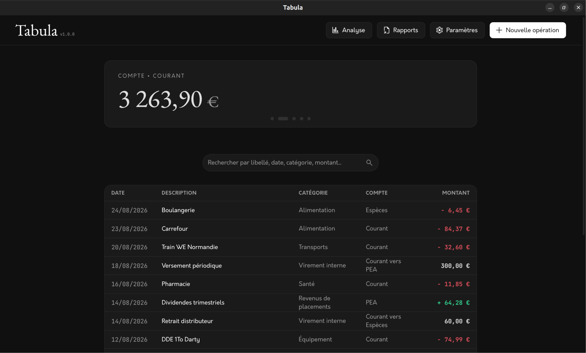
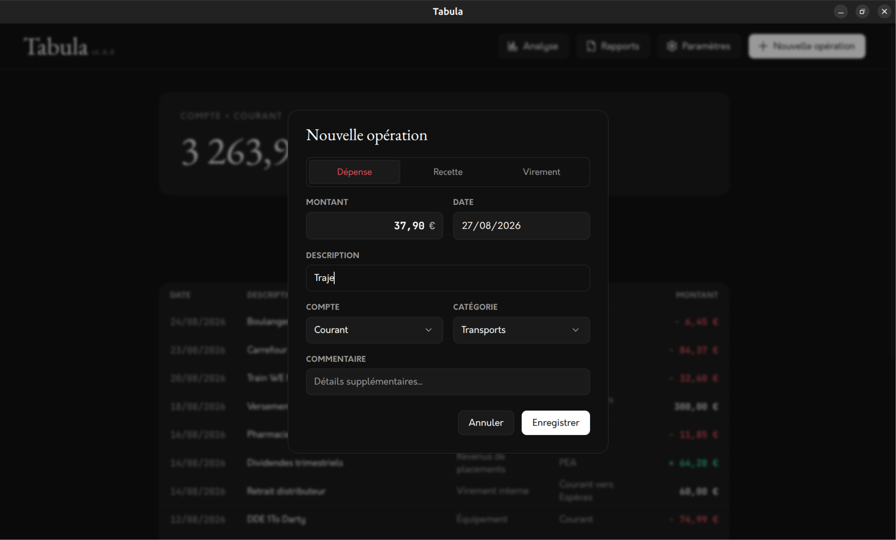
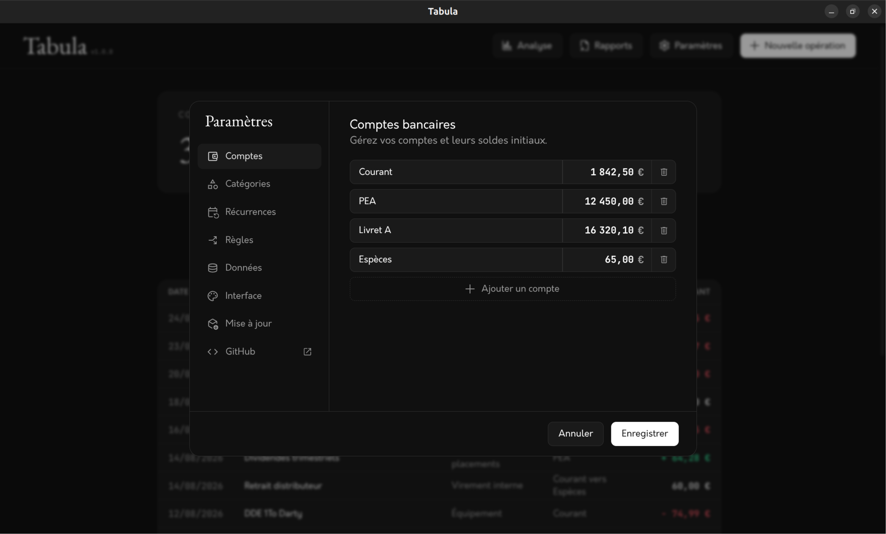

# Tabula

Tabula est une application de bureau personnelle pour suivre ses dépenses et ses revenus au quotidien. Conçue pour un usage local et autonome, elle fonctionne directement sur la machine, sans compte utilisateur, sans serveur et sans collecte de données.




## Fonctionnalités

- **Gestion des comptes et catégories :** Création libre de comptes bancaires (avec solde initial) et de catégories personnalisées.
- **Recherche en direct :** Filtrage à la frappe sans prise en compte des accents et de la casse ; recherche par description, date, catégorie, compte ou montant.
- **Carrousel des soldes :** Visualisation du solde global et défilement entre les différents comptes.
- **Précision monétaire :** Calculs gérés en centimes entiers pour éviter les erreurs d'arrondi.
- **Gestionnaire de mise à jour :** Détection des nouvelles versions publiées depuis les paramètres de l'application.
- **Thèmes :** Prise en charge du thème sombre, clair ou système.
- **Gestion des données :** Sauvegarde, restauration, choix de l'emplacement et réinitialisation de la base locale au format JSON.

<p align="center">
  
  
</p>


## Fonctionnement technique

L'application est développée avec les technologies web standards, sans framework JavaScript :

- **Socle :** [Electron](https://www.electronjs.org/) & [Node.js](https://nodejs.org/)
- **Interface :** HTML5, CSS3 et JavaScript vanilla (ES6)
- **Stockage :** Fichier JSON local


## Téléchargement et installation

Les paquets compilés sont disponibles dans la section [Releases](https://github.com/jdecroocq/tabula/releases).

### Linux

- **Paquet Debian / Ubuntu (`.deb`) :**
   Installation avec un gestionnaire de paquets graphique ou en ligne de commande :
   ```bash
   sudo apt install ./tabula_*.deb
   ```

- **Binaire autonome (`.AppImage`) :**
   Rendre le fichier exécutable et le lancer :
   ```bash
   chmod +x Tabula-*.AppImage
   ./Tabula-*.AppImage
   ```

### Windows

- **Installateur standard (`Setup.exe`) :**
  Double-cliquez sur le fichier pour installer Tabula et créer les raccourcis Bureau et Menu Démarrer.
- **Version portable (`.exe`) :**
  Exécutable autonome prêt à l'emploi sans installation (idéal sur clé USB).

### macOS
La prise en charge de macOS n'est pas proposée pour le moment.


## Évolutions à venir

Le socle est pleinement opérationnel. Les versions mineures suivantes apporteront progressivement :

- Outils d'analyse financière et visualisations graphiques.
- Module de génération et d'exportation de rapports comptables (PDF, CSV).
- Planification automatique des opérations récurrentes (abonnements, loyers).
- Règles d'automatisation et d'auto-complétion à la saisie.
- Support natif de macOS (`.dmg`).


## Lancer le projet en local

Pour exécuter ou modifier le code source sur sa machine :

```bash
# 1. Cloner le projet
git clone https://github.com/jdecroocq/tabula.git
cd tabula

# 2. Installer les dépendances
npm install

# 3. Lancer l'application
npm start

# 4. Compiler pour Linux (.deb et .AppImage)
npm run dist
```


## Licence

Ce projet est sous licence [MIT](LICENSE).